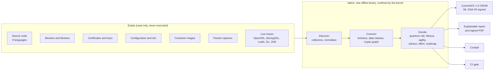

# LATTICE

**SIH26164 · Enterprise Cryptographic Discovery & Analysis Tool (ECDAT)** · NTRO ·
Blockchain & Cybersecurity · Software · Team **DoodleByte**

LATTICE is an offline cryptographic discovery and post-quantum migration decision engine. It reads
an estate (source code, binaries, certificates, keys, server configuration, infrastructure-as-code,
container images, packet captures of live traffic, and traces of running processes) without
executing or modifying anything. It produces a strict CycloneDX 1.6 CBOM and an explainable risk
assessment: which cryptography protects long-lived data on an exposed path, when a quantum computer
breaks it, what replaces it, in what order, and at what cost against India's 2027-2029 timeline.

The full specification starts at [`docs/00-INDEX.md`](docs/00-INDEX.md); build status and measured
performance are in [`docs/IMPLEMENTATION.md`](docs/IMPLEMENTATION.md).



## Try it in one command

```bash
cd cockpit && npm ci && npm run build && cd ..      # build the cockpit first, so it is compiled in
cargo build --release -p lattice-cli
scripts/demo.sh --serve                             # the whole demo, step by step, then the cockpit
```

`scripts/demo.sh` copies the demo estate to `~/lattice-demo` and runs, in order: the sandbox check,
the scan, schema validation, ML-DSA signing, tamper detection, the CI gate, a policy change and a
reproducibility check. Every step's exit code is checked; `--no-pause` runs it straight through.

Signed, reproducible release packages for Linux (x86_64, aarch64) and Windows (x86_64), with SBOMs
and LATTICE's own CBOM, are described in [`docs/release.md`](docs/release.md).

## Build

Requires Rust (pinned in `rust-toolchain.toml`) and, for the cockpit, Node.js 20+. Dependencies
are fetched on the build machine only; the scanner and server make no network calls.

```bash
cd cockpit && npm ci && npm run build && cd ..
cargo build --release -p lattice-cli
```

The binary is `target/release/lattice`. When `cockpit/dist` exists at build time the cockpit is
compiled into the binary; otherwise `serve` looks for it beside the binary or takes `--ui <dir>`.

## Use

```bash
# scan: CBOM + explainable report (+ the executive PDF)
lattice scan examples/demo-estate -o demo.cbom.json --report demo.report.json --pdf demo.pdf

# or render the PDF later from a report, signed like a CBOM
lattice report demo.report.json -o demo.pdf \
    --sign-with keys/lattice-signing.key --public-key keys/lattice-signing.pub
lattice verify demo.pdf --public-key keys/lattice-signing.pub

# sign and verify (ML-DSA-65, FIPS 204)
lattice keygen --out-dir keys
lattice sign demo.cbom.json --key keys/lattice-signing.key --public-key keys/lattice-signing.pub
lattice verify demo.cbom.json --public-key keys/lattice-signing.pub

# validate against the official CycloneDX 1.6 schema (offline)
lattice validate demo.cbom.json

# on a live Linux host (root): which cryptography do running processes actually use?
sudo lattice trace --duration 300 -o estate/payments-api/prod-1.lattice-trace.json
lattice trace --dry-run      # what would be probed, without privilege
# OpenSSL, and running Go and Rust (rustls, AWS-LC, ring) programs, are probed; name others with --binary
lattice trace --jvm --duration 300 -o estate/billing/prod-1.lattice-trace.json   # Java, via JFR

# serve the cockpit to named users with roles; every call lands in a hash-chained audit log
lattice user add --name alice --role operator --users users.toml
lattice serve --root estate=/srv/code --users users.toml --data-dir .lattice \
    --bind 0.0.0.0:7443 --tls-cert server.pem --tls-key server.key   # TLS 1.3, X25519MLKEM768 first
# or pin client certificates instead of tokens, and require them (mutual TLS)
lattice user add --name bob --role viewer --certificate bob.pem --users users.toml
lattice serve ... --client-ca clients-ca.pem
lattice audit verify .lattice/audit.jsonl

# CI gate: exit 1 on new or worsened high-risk crypto, 3 if the signed baseline fails verification
lattice ci examples/demo-estate --baseline demo.cbom.json --trusted-key keys/lattice-signing.pub --fail-on high

# cockpit and API on http://127.0.0.1:7443; scans can read only the named roots
lattice serve --root demo=examples/demo-estate

# signed knowledge updates, installed independently of releases
lattice knowledge --help
```

On Linux every command that reads untrusted content confines itself first (Landlock: targets
read-only, outputs the only writable places; seccomp: no network, no program execution).
`lattice sandbox-check` shows what the kernel enforces; `--sandbox required` refuses to run without it.
Release builds, verification, the systemd unit and the container image: [`docs/release.md`](docs/release.md).

Set `SOURCE_DATE_EPOCH` for byte-reproducible output. Add `--cache DIR` to `scan`, `ci` or
`serve` to skip files that have not changed since the last scan; the output is identical. `--policy`
replaces the embedded risk policy ([`knowledge/policy.toml`](knowledge/policy.toml)): Q-day window,
exposure and liveness weights, data classes and their secrecy lifetimes.

## Platforms

| Platform | Scan, CBOM, report, serve | Self-confinement | Runtime tracing |
|---|---|---|---|
| Linux x86_64, aarch64 | Yes | Landlock + seccomp | Yes (root; Java needs none for your own JVMs) |
| Windows x86_64 | Yes, same output as Linux byte for byte | Process mitigations (no child processes, no dynamic code) | No |
| macOS | Built and tested in CI | None | No |

## Workspace

| Path | Responsibility |
|---|---|
| `crates/lattice-core` | Domain model, algorithm knowledge base, name parsing, normalisation, policy |
| `crates/lattice-collectors` | Source (9 languages), binary, PKI, configuration, container-image, packet-capture and trace collectors; bounded, isolated |
| `crates/lattice-classify` | Explainable data classification and secrecy lifetimes |
| `crates/lattice-graph` | Entry point → function → crypto → data graph, reachability and exposure |
| `crates/lattice-risk` | Quantum breakability, HNDL/TNFL index, crypto-agility, Mosca, priority, advisor, roadmap, effort and timeline |
| `crates/lattice-cbom` | CycloneDX 1.6 emitter, schema validation, ML-DSA-65 signatures |
| `crates/lattice-report` | The deterministic, signable executive PDF |
| `crates/lattice-engine` | The pipeline and baseline comparison |
| `crates/lattice-tracer` | Runtime tracing: kernel uprobes (OpenSSL, BoringSSL, AWS-LC, ring, Go) and the JVM's Flight Recorder |
| `crates/lattice-server` | HTTP API, TLS and mutual TLS, roles, audit log, and the compiled-in cockpit (axum) |
| `crates/lattice-sandbox` | Landlock and seccomp self-confinement; process mitigations on Windows |
| `crates/lattice-cli` | `scan`, `ci`, `report`, `keygen`, `sign`, `verify`, `validate`, `serve`, `trace`, `user`, `audit`, `knowledge`, `sandbox-check` |
| `cockpit` | React cockpit: overview, inventory, crypto graph, roadmap, compare, scans, audit log |
| `knowledge`, `rules` | Versioned algorithm knowledge, risk policy and detection rules |
| `examples/demo-estate` | A realistic multi-service estate for demonstration |
| `packaging`, `scripts` | systemd unit, container image, reproducible releases, the demo, toolchain, fuzzing, golden scan |

## Validation

```bash
cargo fmt --all -- --check
cargo clippy --workspace --all-targets -- -D warnings
cargo test --workspace
cd cockpit && npm run typecheck
scripts/fuzz.py -t 300                  # every parser, 5 minutes each (nightly + cargo-fuzz)
```

CI (`.github/workflows/ci.yml`) runs all of the above on every push, on Linux, Windows and macOS,
plus a scan of OpenSSL 3.5.5 compared against a reviewed summary
(`scripts/openssl-golden.py --lattice target/release/lattice`), tracer tests against real Go,
rustls and Java programs (Java recorded live), and a fuzz of every parser (longer nightly).

The demo estate's CBOM is a golden file: when a change to it is intended, regenerate it with
`LATTICE_BLESS=1 cargo test -p lattice-engine --test golden` and review the diff.

## Licence

Apache License 2.0; see [`LICENSE`](LICENSE).
