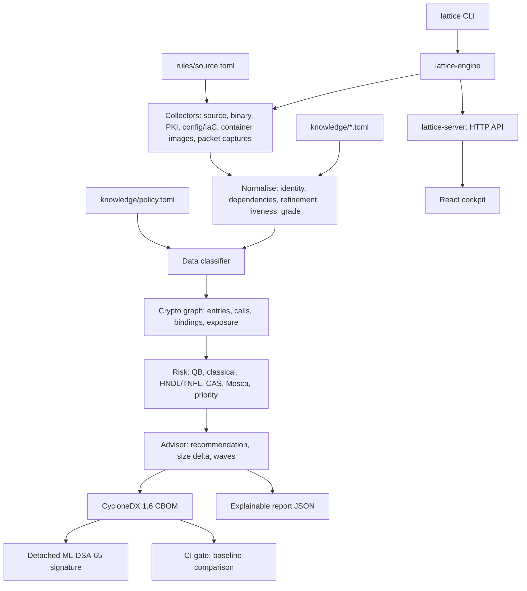

# Implementation status

This document tracks the code against the architecture in [`architecture.md`](architecture.md). A capability is marked delivered only when it is executable and covered by tests. The workspace builds with `cargo clippy --workspace --all-targets -- -D warnings` clean, and all 211 tests pass. The cockpit typechecks under strict TypeScript.

## Pipeline as built



## Crates

| Crate | Responsibility | Tests |
|---|---|---|
| `lattice-core` | Domain model, algorithm knowledge base, name parsers, normalisation, policy | 46 |
| `lattice-collectors` | Source (tree-sitter, 9 languages), binary (ELF/PE/Mach-O symbols, constant tables, OIDs), PKI (X.509, PKCS#1/#8, SEC1, OpenSSH), config and Terraform, container images (docker save, OCI, tarballs), packet captures (pcap, pcapng: TLS, SSH); walker, sandbox, incremental cache, key custody (PKCS#11, TPM, Vault, crypttab, cloud KMS/HSM) | 74 |
| `lattice-classify` | Data classification from identifiers, parameters, functions, paths | 8 |
| `lattice-graph` | Crypto graph, entry-point reachability, exposure, data inheritance | 5 |
| `lattice-risk` | Assessor (QB, threat, HNDL/TNFL index, CAS, Mosca range, tiers) and advisor (recommendations, FIPS 203/204 size deltas, roadmap waves, effort estimates, the plan against the timeline, custody-aware advice); property tests of the scoring invariants | 20 |
| `lattice-cbom` | Strict CycloneDX 1.6 emitter, offline schema validation, detached ML-DSA-65 signing (CBOMs and arbitrary content) | 16 |
| `lattice-engine` | Orchestration, traffic attribution, report, baseline comparison, signed knowledge bundles; golden CBOM of the demo estate | 12 |
| `lattice-server` | HTTP API, scan queue, persistence, cockpit hosting, request guards, users and roles, hash-chained audit log, TLS 1.3 with X25519MLKEM768 and mutual TLS | 13 |
| `lattice-report` | Executive PDF: a deterministic PDF writer (standard fonts, exact metrics) and the report layout, rendered from the report JSON | 5 |
| `lattice-sandbox` | Process confinement: Landlock filesystem rules, seccomp system-call filter | via `sandbox-check` |
| `lattice-cli` | `scan`, `ci`, `keygen`, `sign`, `verify`, `validate`, `report`, `serve`, `user`, `audit`, `sandbox-check`, `knowledge` | 9 end-to-end |
| `cockpit` | React 19 + TypeScript: overview and Mosca timeline, inventory, explanation drawer, exposure graph, roadmap, compare, scan launcher | typecheck |

## Guarantees enforced by tests

- **Read-only, offline.** Targets are read, never executed or modified. No network client exists in the scan path. The `jsonschema` dependency is built without its HTTP resolver, and the CycloneDX schemas are vendored.
- **Bounded.** Size limit per file, deadline per collector per file (cancellable tree-sitter parsing), panic isolation per file. Failures are reported, never silently dropped.
- **No secrets in output.** Key material is identified by BLAKE3 fingerprint. Reports carry relative paths only, and a test asserts the absolute scan root never appears.
- **Strict CycloneDX 1.6.** Every CBOM the engine emits validates against the official 1.6.1 schema (`additionalProperties: false` included). All `bom-ref` references resolve. LATTICE data travels as `lattice:` namespaced properties.
- **Reproducible.** The same target plus `SOURCE_DATE_EPOCH` gives byte-identical CBOM and report.
- **Explainable.** Every index term, agility factor, liveness level, evidence grade, data class and Mosca verdict carries its reason.
- **Tamper evident.** The detached ML-DSA-65 signature covers the exact CBOM bytes plus a per-component BLAKE3 chain. Verification names the altered, removed or reordered component, rejects untrusted keys, and rejects re-hashed forgeries.
- **Server hardening.** Loopback by default; a non-loopback bind is refused without credentials. Named users with viewer, operator and admin roles (401 for unknown tokens, 403 for too weak a role); every API call is appended to a hash-chained audit log the server verifies before starting. TLS 1.3 only, X25519MLKEM768 first, optional mutual TLS; non-loopback addresses are never served over plain HTTP by default. Host-header checks defeat DNS rebinding. Scans are confined to operator-declared roots (canonicalised, symlink escapes refused). Strict CSP with no inline script, `no-store` on the API, 16 KiB request bodies, unknown fields rejected, bounded scan queue, one scan at a time.
- **Fuzzed.** Eight `cargo-fuzz` targets cover every parser of hostile input (`fuzz/`, `scripts/fuzz.py`).
- **Stable output.** The demo estate's CBOM is compared byte for byte with a reviewed golden file.
- **CI contract.** Exit code 0 means clean, 1 a regression at or above `--fail-on`, 2 a usage or scan error, 3 a verification failure. A baseline can be required to be signed.

## Milestones

| Capability | Status |
|---|---|
| Domain model, knowledge base, name parsing | Delivered |
| Source, binary, PKI, config and IaC collectors | Delivered |
| Normalisation (dependencies, refinement, protocol settings) | Delivered |
| Data classifier | Delivered |
| Crypto graph and exposure | Delivered |
| Risk engine and advisor | Delivered |
| CycloneDX 1.6 CBOM with schema validation | Delivered |
| ML-DSA-65 signing and verification | Delivered |
| CLI and CI gate | Delivered |
| HTTP API (axum) and React cockpit | Delivered |
| Container image collector (docker save, OCI layouts, whiteouts, dpkg/apk) | Delivered |
| Runtime collector (pcap/pcapng: TLS and SSH handshakes → `Confirmed`) | Delivered |
| OS sandboxing (Landlock, seccomp) | Delivered |
| Release packaging (static musl binaries, SBOM, signatures, systemd unit, container image) | Delivered |
| Signed knowledge bundles (monotonic, validated whole, fail-closed) | Delivered |
| Incremental scans (content-addressed cache, byte-identical output) | Delivered |
| Assurance: property tests, golden CBOM, cargo-fuzz targets for every parser | Delivered |
| Effort estimates and the roadmap scheduled against the India DST 2027–2029 timeline | Delivered |
| Executive PDF report, deterministic and signed (CLI, API, cockpit) | Delivered |
| Users and roles, hash-chained audit log | Delivered |
| Server TLS 1.3 with X25519MLKEM768 first, mutual TLS | Delivered |
| Key custody: keys in HSMs, TPMs and cloud key services | Delivered |

## Usage

```bash
lattice scan ./service -o service.cbom.json --report service.report.json
lattice keygen --out-dir keys
lattice sign service.cbom.json --key keys/lattice-signing.key --public-key keys/lattice-signing.pub
lattice verify service.cbom.json --public-key keys/lattice-signing.pub
lattice validate service.cbom.json
lattice ci ./service --baseline service.cbom.json --trusted-key keys/lattice-signing.pub --fail-on high
lattice serve --root estate=/srv/code --ui cockpit/dist
```

## Sandbox and releases

- **Self-confinement.** `scan`, `ci`, `validate`, `verify` and `serve` confine themselves on Linux before touching untrusted content: Landlock makes the targets read-only and the output directories the only writable places; seccomp forbids new sockets, program execution, ptrace, mounts, namespaces, kernel modules, BPF and keyrings, on every thread. Inputs (policy, keys, baselines) are read first; the server binds its listener first, so after confinement it can accept connections but never open one. `--sandbox required|best-effort|off`; the status is printed with every scan and reported by `/api/health` and the cockpit.
- **Proof, not claims.** `lattice sandbox-check` runs a confined child that attempts each forbidden operation (read outside the targets, modify a target, open a connection, run a program) and reports what the kernel did. On the development kernel (6.18) every probe is denied.
- **Releases.** `scripts/release.sh` builds static musl binaries for x86_64 and aarch64 with remapped paths, and reproducible archives. Each archive comes with a CycloneDX 1.6 SBOM (crates and npm packages actually shipped, every file's SHA-256, the archive hash), an optional ML-DSA-65 signature over that SBOM, and LATTICE's own CBOM of its binary. See [`release.md`](release.md).
- **Deployment.** A hardened systemd unit (dynamic user, no capabilities, read-only system, no outbound network, system-call allow-list, and `--sandbox required` inside) and a `scratch` container image running as a non-root user.

## Containers and runtime evidence

- **Images** are streamed, never extracted: `docker save` archives, OCI layouts packed as tar, and plain tarballs, gzip or not. Layers are applied in order with OCI whiteout and opaque-directory semantics, so only what a container would actually contain is reported. The dpkg and apk databases identify cryptographic libraries by package version (OpenSSL 3.0.13 is not PQC-capable, 3.5.0+ is), and the image's environment goes through the configuration collector. The image tag is the component.
- **Captures** (pcap, pcapng; Ethernet, VLAN, Linux cooked, loopback, raw IP; IPv4 and IPv6) are reassembled per TCP connection, tolerating reordering and retransmission. From TLS the collector reads the server name, negotiated version, cipher suite, key-exchange group (TLS 1.3 key share or TLS 1.2 ServerKeyExchange) and, before TLS 1.3, the certificate chain; from SSH both KEXINIT messages and the negotiated algorithms. Application data and client addresses are never decoded or stored.
- **Correlation.** A handshake's server name is matched to the TLS listener that answers to it (nginx `server_name`, Apache `ServerName`/`ServerAlias`, wildcards included), so a version configured in nginx and negotiated on the wire becomes one `Confirmed` asset graded B (artefact and runtime layers).
- **Bounds.** Archive size, expanded bytes (decompression bombs), entries per layer, packets, flows, bytes per flow and wall time are all limited; zstd layers are reported rather than guessed at; archive paths cannot climb out with `..`.
- **Demo artefacts** are produced by `scripts/make-demo-artefacts.py`: real OpenSSL 3.5 handshakes (TLS 1.0 with static RSA, TLS 1.2 ECDHE, TLS 1.3 with X25519MLKEM768) recorded through a relay into a pcap, and a `docker save` archive of the payments service.

## Accuracy fixes found by running the demo estate

Running `examples/demo-estate` end to end through the cockpit exposed and fixed:

- TLS suite hashes are HMACs in CBC suites (`DES-CBC3-SHA` is HMAC-SHA1, not a broken SHA-1), and a MAC's or KDF's digest is a parameter, not a separate hash asset.
- Keyword-argument names (`public_exponent=`) and nested callees (`padding.OAEP`) are API vocabulary, not data evidence.
- A function calling a method on a module-level key (`_key.public_key()`) is linked to that key, so routes reach it.
- A TLS listener is itself an entry point: what it configures, and the certificates and keys its configuration references, are reachable through it.
- Mosca applies only to assets a quantum computer actually breaks (breakability ≥ 0.5): SHA-256 and AES-256 keep an adequate margin.
- Estates without a root manifest make each top-level directory a component.
- The server re-stamps the assessment year per scan.
