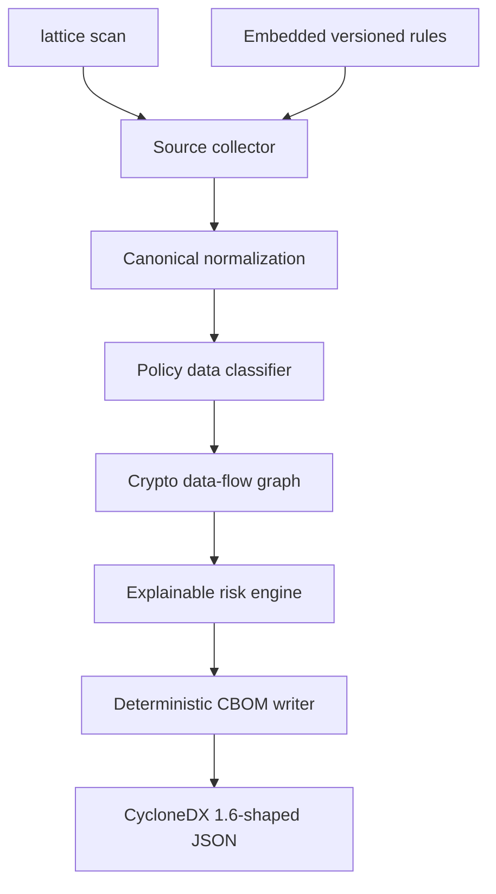

# Implementation status

This document tracks the code against the architecture in [`architecture.md`](architecture.md). It is intentionally conservative: a capability is marked complete only when executable and tested.

## Delivered: foundation vertical slice

### Production properties already enforced

- The target is read-only and target code is never executed.
- The scan path contains no network client dependency.
- Symlinks are not followed and dependency/build directories are excluded.
- Files have a configurable hard size limit.
- A parse failure or panic is isolated to one file and produces a partial-result warning.
- Reports use relative slash-normalized paths rather than leaking the host scan root.
- Evidence retains matched API tokens, not source lines or potential secrets.
- Tree-sitter validates C/C++, Python, and Java candidates; comment-only matches are rejected.
- ELF, PE, and Mach-O files are magic-checked and scanned for bounded crypto symbol signatures with byte-offset evidence.
- Config files are comment-aware and scanned for TLS, JWT, KMS/key-spec, classical, and PQC selections.
- Equivalent algorithm parameter sets correlate across surfaces; collector metadata and locations remain distinct.
- Asset IDs, component ordering, score calculations, and JSON output are deterministic.
- The assessment year and Q-day policy are explicit reproducibility inputs.
- Data-classification decisions carry rule version, confidence, and a human-readable explanation.
- Per-asset lifetime, criticality, protected-data IDs, and reachable entry points come from graph traversal.

## Milestone status

| Architecture capability | Status | Next acceptance criterion |
|---|---|---|
| Shared domain model and canonical IDs | Cross-surface correlation implemented | Add component/repository scope for estate-wide orchestration |
| Source discovery: C, Python, Java | AST-validated rules implemented | Add broader golden fixtures and semantic API argument extraction |
| Quantum Breakability map | Implemented | Load signed knowledge version instead of compile-time map |
| Mosca, HNDL, CAS | Graph-enriched baseline | Add protocol-specific migration cost and analyst policy overrides |
| PQC/hybrid advisor | Implemented baseline | Add protocol-specific compatibility and measured cost tables |
| CycloneDX writer | Initial serializer | Validate strict output against official CycloneDX 1.6 schema |
| Binary/library collector | Initial magic + symbol collector | Add format-native import parsing and cross-surface correlation |
| Container collector | Not started | Bounded OCI layer walk reusing source/binary collectors |
| Certificate/config collector | Config signature baseline | Add structured TLS parsing and X.509 certificate analysis |
| Crypto Data-Flow Graph | Initial in-memory graph and traversals | Add semantic call graph, redb persistence, and graph export API |
| Data classifier | Metadata-rule baseline | Add field-level rules and analyst-overridable labels |
| Runtime/pcap collector | Not started | Upgrade matching assets to `Confirmed` from captured TLS evidence |
| Hash chain and ML-DSA signing | Not started | Offline `sign` and `verify` commands with negative tests |
| Embedded API and cockpit | Not started | Inventory, graph, heatmap, Mosca, roadmap, progress stream |
| CI regression gate | Not started | Signed baseline diff and documented exit code taxonomy |

## Immediate build order

1. Add format-native binary import parsing and component-scoped correlation for multi-repository scans.
2. Enrich the graph with semantic call relationships and persist it in embedded redb.
3. Make strict CycloneDX interoperability a CI gate with a checked-in schema and golden CBOM.
4. Add the `axum` API contract, then build the React cockpit against that stable contract.
5. Add container/config/pcap collectors, signing, baseline diffing, and hardened packaging.

## Known boundary of this slice

The emitted document follows the designed CBOM shape but has not yet been validated against the official CycloneDX 1.6 JSON schema. The custom top-level component `lattice` extension may need representation through namespaced CycloneDX `properties` for strict third-party interoperability. Until schema validation is implemented, the CLI and README deliberately describe it as “CycloneDX 1.6-shaped,” not certified schema-valid output.
